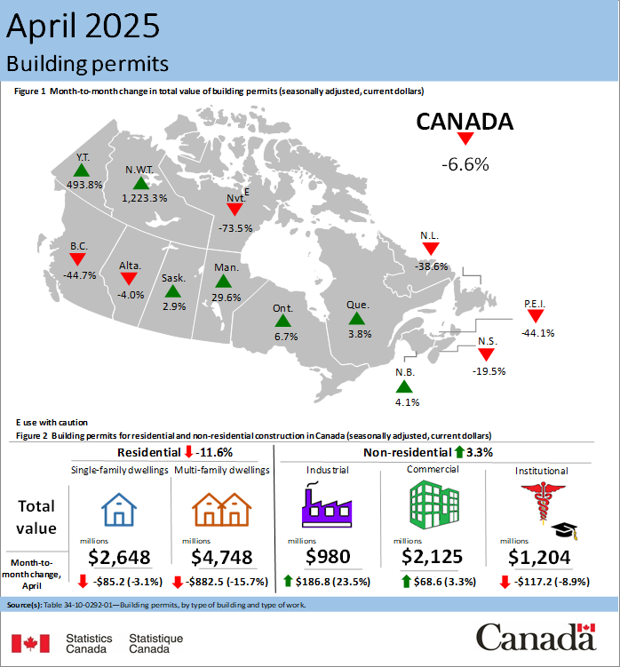

# Data Visualization Tips

## Time Series Clarity

-   Display dates/time frames on the x-axis in ascending order (unless
    there's a specific reason not to). This ensures intuitive trend
    interpretation

## Label Everything

-   Always label axes and include units (e.g., \"Percentage (%)\" or
    \"Population (thousands)\").
-   Define variables and terms in captions or legends (e.g., clarify if
    \"46.0\" represents people, percentages, or scaled values).

## Title & Context

-   Use clear, descriptive titles that specify the metric (e.g., \"Mean
    Household Income (2020--2024)\" instead of \"Income Trends\").
-   Indicate whether values are sums, means, medians, etc. (e.g.,
    \"Median Wait Times for Emergency Care\").

## Plot Type Selection

-   Line charts: Trends over time
-   Bar charts: Category comparisons
-   Boxplots/Violin plots: Distributions

## Design Best Practices

-   Use consistent colors/legends across plots to aid comparison.
-   Annotate key trends (e.g., \"Peak in 2021\" with an arrow).
-   Avoid clutter: Split complex data into multiple plots.

## Avoid Misleading Scales

-   Start y-axis at zero unless justified (e.g., log scales). If
    truncated, explain why in the caption.

## Accessibility

-   Ensure color choices are colorblind-friendly (tools: ColorBrewer).
-   Use patterns/textures in addition to colors for B&W printing.

## Normalization for Comparisons

-   Normalization removes scale differences, letting viewers focus on
    relative changes.

-   

    When to normalize:

    :   -   If the main goal is to compare trends or patterns (not
            absolute values), scale values to a common range (e.g., 0--1
            or 0--100%).

-   

    How to label:

    :   -   Clearly state the normalization method in the axis/caption
            (e.g., *\"Values normalized to 2015 baseline (=100%)\"* or
            \"Percent of total group\").

-   

    Caveats:

    :   -   Avoid normalization if absolute values matter (e.g., budget
            allocations in dollars).

## Examples

**Infographic: Building Permits in Canada**

It\'s important to include clear elements such as a title, map,
explanation, and tables or summary boxes. These elements help ensure
your message is easy to understand at a glance. The infographic below
summarizes building permits in Canada for April 2025:

[{.align-center
width="60.0%"}](https://www150.statcan.gc.ca/n1/daily-quotidien/250611/g-b001-eng.htm?utm_source=lnkn&utm_medium=smo&utm_campaign=statcan-general)

Notice how it uses a combination of:

-   Title: Clearly states the topic and time period.
-   Map: Visualizes geographic differences across provinces and
    territories.
-   Explanations: Uses color, arrows, and percentages to highlight
    changes.
-   Tables/Summaries: Breaks down the data into categories (residential,
    non-residential) and uses icons for quick interpretation.
-   Source: Properly cites the data source at the bottom.
